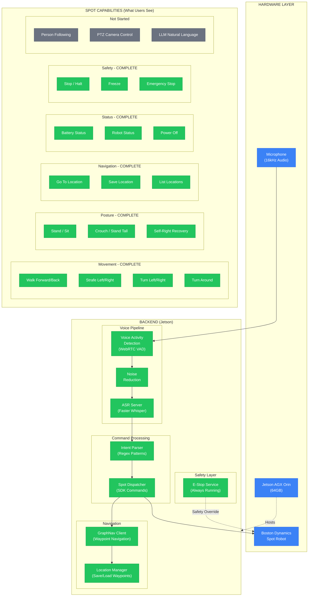

# Spot Voice Control System Architecture

## Status Legend
- **GREEN** = Completed & Working
- **YELLOW** = In Progress / Partial
- **RED/GRAY** = Not Started

---

## System Diagram (Mermaid)



---

## System Diagram (ASCII)

```
╔══════════════════════════════════════════════════════════════════════════════╗
║                         SPOT VOICE CONTROL SYSTEM                            ║
╠══════════════════════════════════════════════════════════════════════════════╣
║                                                                              ║
║  ┌─────────────────────────────────────────────────────────────────────────┐ ║
║  │                        HARDWARE LAYER                                   │ ║
║  │  ┌──────────────┐    ┌──────────────────┐    ┌────────────────────┐    │ ║
║  │  │  Microphone  │    │  Jetson AGX Orin │    │   Boston Dynamics  │    │ ║
║  │  │  (16kHz)     │    │  (64GB RAM)      │    │      Spot Robot    │    │ ║
║  │  └──────┬───────┘    └────────┬─────────┘    └─────────▲──────────┘    │ ║
║  └─────────┼─────────────────────┼─────────────────────────┼──────────────┘ ║
║            │                     │                         │                 ║
║            ▼                     │ HOSTS                   │                 ║
║  ┌─────────────────────────────────────────────────────────┼───────────────┐ ║
║  │                      BACKEND (Jetson)                   │               │ ║
║  │                                                         │               │ ║
║  │  ╔═══════════════════════════════════════════════════╗  │               │ ║
║  │  ║            VOICE PIPELINE [COMPLETE]              ║  │               │ ║
║  │  ║  ┌─────────┐   ┌─────────┐   ┌─────────────────┐  ║  │               │ ║
║  │  ║  │   VAD   │──▶│  Noise  │──▶│   ASR Server    │  ║  │               │ ║
║  │  ║  │(WebRTC) │   │Reduction│   │(Faster Whisper) │  ║  │               │ ║
║  │  ║  └─────────┘   └─────────┘   └────────┬────────┘  ║  │               │ ║
║  │  ╚═══════════════════════════════════════┼═══════════╝  │               │ ║
║  │                                          │              │               │ ║
║  │                                          ▼              │               │ ║
║  │  ╔═══════════════════════════════════════════════════╗  │               │ ║
║  │  ║         COMMAND PROCESSING [COMPLETE]             ║  │               │ ║
║  │  ║  ┌─────────────────┐   ┌────────────────────────┐ ║  │               │ ║
║  │  ║  │  Intent Parser  │──▶│    Spot Dispatcher     │─╫──┼───────────────┤ ║
║  │  ║  │ (Regex Patterns)│   │    (SDK Commands)      │ ║  │               │ ║
║  │  ║  └─────────────────┘   └───────────┬────────────┘ ║  │               │ ║
║  │  ╚════════════════════════════════════┼══════════════╝  │               │ ║
║  │                                       │                 │               │ ║
║  │                                       ▼                 │               │ ║
║  │  ╔═════════════════════════════════════════════════╗    │               │ ║
║  │  ║          NAVIGATION [COMPLETE]                  ║    │               │ ║
║  │  ║  ┌───────────────┐   ┌────────────────────────┐ ║    │               │ ║
║  │  ║  │ GraphNav      │◄──│   Location Manager     │ ║    │               │ ║
║  │  ║  │ (Waypoints)   │   │   (Save/Load)          │ ║    │               │ ║
║  │  ║  └───────────────┘   └────────────────────────┘ ║    │               │ ║
║  │  ╚═════════════════════════════════════════════════╝    │               │ ║
║  │                                                         │               │ ║
║  │  ╔═════════════════════════════════════════════════╗    │               │ ║
║  │  ║          SAFETY LAYER [COMPLETE]                ║    │               │ ║
║  │  ║  ┌─────────────────────────────────────────────┐║    │               │ ║
║  │  ║  │         E-Stop Service (Always Running)     │╠════╪═══════════════╡ ║
║  │  ║  │              Safety Override                │║    │  OVERRIDE     │ ║
║  │  ║  └─────────────────────────────────────────────┘║    │               │ ║
║  │  ╚═════════════════════════════════════════════════╝    │               │ ║
║  └─────────────────────────────────────────────────────────┘               │ ║
║                                                                            │ ║
╠════════════════════════════════════════════════════════════════════════════╣ ║
║                                                                              ║
║                    SPOT CAPABILITIES (What Users See)                        ║
║                                                                              ║
║  ┌────────────────────────────────────────────────────────────────────────┐  ║
║  │                     ✅ COMPLETE (Green)                                │  ║
║  │                                                                        │  ║
║  │  ┌─────────────────┐ ┌─────────────────┐ ┌─────────────────┐          │  ║
║  │  │    MOVEMENT     │ │     POSTURE     │ │   NAVIGATION    │          │  ║
║  │  │─────────────────│ │─────────────────│ │─────────────────│          │  ║
║  │  │ • Walk Fwd/Back │ │ • Stand / Sit   │ │ • Go To Location│          │  ║
║  │  │ • Strafe L/R    │ │ • Crouch        │ │ • Save Location │          │  ║
║  │  │ • Turn L/R      │ │ • Stand Tall    │ │ • List Locations│          │  ║
║  │  │ • Turn Around   │ │ • Self-Right    │ │                 │          │  ║
║  │  └─────────────────┘ └─────────────────┘ └─────────────────┘          │  ║
║  │                                                                        │  ║
║  │  ┌─────────────────┐ ┌─────────────────┐                              │  ║
║  │  │     STATUS      │ │     SAFETY      │                              │  ║
║  │  │─────────────────│ │─────────────────│                              │  ║
║  │  │ • Battery Level │ │ • Stop / Halt   │                              │  ║
║  │  │ • Robot Status  │ │ • Freeze        │                              │  ║
║  │  │ • Power Off     │ │ • E-Stop        │                              │  ║
║  │  └─────────────────┘ └─────────────────┘                              │  ║
║  └────────────────────────────────────────────────────────────────────────┘  ║
║                                                                              ║
║  ┌────────────────────────────────────────────────────────────────────────┐  ║
║  │                     ⬜ NOT STARTED (Gray)                              │  ║
║  │                                                                        │  ║
║  │  ┌─────────────────┐ ┌─────────────────┐ ┌─────────────────┐          │  ║
║  │  │ Person Following│ │ PTZ Camera Ctrl │ │ LLM Natural Lang│          │  ║
║  │  │ (Needs Vision)  │ │ (Needs Payload) │ │ (Ollama Ready)  │          │  ║
║  │  └─────────────────┘ └─────────────────┘ └─────────────────┘          │  ║
║  └────────────────────────────────────────────────────────────────────────┘  ║
║                                                                              ║
╚══════════════════════════════════════════════════════════════════════════════╝
```

---

## Data Flow Summary

```
User Speaks → Microphone → VAD → Noise Reduction → Whisper ASR → Intent Parser → Spot Dispatcher → Robot Action
                                                                        │
                                                                        ├── Movement Commands (SDK)
                                                                        ├── GraphNav (Waypoints)
                                                                        └── Status Queries
```

---

## Component Status Table

| Component | Status | File(s) |
|-----------|--------|---------|
| Voice Activity Detection | ✅ Complete | `client_mic.py` |
| Noise Reduction | ✅ Complete | `client_mic.py` |
| ASR Server (Whisper) | ✅ Complete | `server.py` |
| Intent Parser (Regex) | ✅ Complete | `intent.py` |
| Spot Dispatcher | ✅ Complete | `spot_dispatch.py` |
| E-Stop Service | ✅ Complete | `scripts/estop_run.py` |
| GraphNav Integration | ✅ Complete | `spot_dispatch.py`, `location_manager.py` |
| Movement Commands | ✅ Complete | 8 commands |
| Posture Commands | ✅ Complete | 5 commands |
| Navigation Commands | ✅ Complete | 3 commands |
| Status Commands | ✅ Complete | 3 commands |
| Safety Commands | ✅ Complete | 3 commands |
| Person Following | ⬜ Not Started | - |
| PTZ Camera | ⬜ Not Started | Requires payload |
| LLM Intent Parser | ⬜ Not Started | `intent_llm.py` ready |

---

## Quick Start Flow

```
1. Start E-Stop       →  python scripts/estop_run.py     (Terminal 1 - Keep open!)
2. Start Voice Ctrl   →  python scripts/run_voice_control.py  (Terminal 2)
3. Speak Commands     →  "Stand up" → "Walk forward 2 meters" → "Go to kitchen"
```
