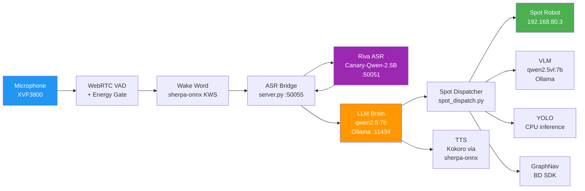

# System Architecture Overview

Voice-controlled Boston Dynamics Spot robot running on Jetson AGX Orin 64GB.
The system takes spoken commands, processes them through an LLM, and dispatches
actions to the robot via the Boston Dynamics SDK.

## High-Level Architecture



**Data flow summary:**
Microphone audio streams through VAD and energy gating, passes the wake word
detector, gets transcribed by Riva ASR via a gRPC bridge, then the transcript
goes to the LLM Brain which returns structured JSON with actions and a spoken
response. The dispatcher executes actions on Spot. Vision queries additionally
invoke the VLM or YOLO models.

## Design Decisions

### 1. Modular ASR Bridge

`server.py` acts as a gRPC bridge between the voice client and NVIDIA Riva.
The client speaks a custom `asr.proto` protocol on port 50055; the server
translates to Riva's native API on port 50051. This decouples the ASR engine
from the rest of the pipeline -- swapping Riva for Whisper, Faster-Whisper, or
any other engine only requires changing `server.py`, not the client.

The server also handles post-processing: hallucination filtering, repetitive
phrase detection, and minimum duration rejection.

### 2. Structured JSON LLM Output

The LLM Brain uses Ollama's `format="json"` parameter, which enforces valid
JSON output at the grammar level. The model fills in a schema:

```json
{"actions": [{"action": "walk", "params": {"direction": "forward", "distance": 2}}],
 "response": "Walking forward 2 meters!"}
```

This avoids unreliable tool-calling protocols. Small 7B models are far more
reliable at filling JSON fields than performing multi-step function calling.
The entire action catalog lives in the system prompt.

### 3. Persistent Spot Session

`src/session.py` provides a `spot_session()` context manager that creates a
single long-lived connection to the robot. Authentication, lease acquisition,
time sync, and power-on happen once at startup. All commands share this
session, eliminating per-command auth overhead (~2s saved per command).

The session uses `LeaseKeepAlive` to maintain the lease and automatically
clears stale keepalive policies from previous sessions.

### 4. Navigation in Background Threads

GraphNav navigation, visual object approach (`go_to_object`), and person
following (`follow_me`) all run in background threads. This keeps the voice
pipeline responsive -- the user can issue new commands (including safety
commands like "stop") while the robot is navigating.

Command chaining (e.g., "go to kitchen then sit down") uses
`_wait_for_nav_complete()` to synchronize between actions.

### 5. CPU-Only Vision

YOLO-World (open-vocabulary detection) and YOLOv8n (person detection) both
run with `device="cpu"`. This keeps the GPU/VRAM entirely free for the LLM
and VLM models. On Jetson AGX Orin, the CPU cores are fast enough for
detection at ~2 Hz, which is sufficient for visual navigation and following.

### 6. Adaptive Noise Floor

The system calibrates ambient noise at startup (2 seconds of silence), then
continuously adapts using EMA smoothing (`alpha=0.03`). During navigation,
the energy threshold is boosted by 5x to suppress motor noise. During follow
mode, the multiplier is only 2x since the user is nearby and speaking.

This prevents false VAD triggers from robot motor noise while still catching
speech at normal conversational distance.

## Component Table

| Component | File | Purpose |
|---|---|---|
| Voice Client | `src/voice_control/client_mic.py` | Main audio loop: VAD, speech detection, ASR dispatch, LLM orchestration |
| ASR Bridge Server | `src/voice_control/server.py` | gRPC bridge to Riva ASR with hallucination filtering |
| LLM Brain | `src/voice_control/llm_brain.py` | Ollama structured JSON for intent parsing + conversational response |
| Spot Dispatcher | `src/voice_control/spot_dispatch.py` | Executes robot commands via BD SDK (movement, nav, vision) |
| Wake Word Detector | `src/voice_control/wake_word.py` | sherpa-onnx keyword spotter for "Hey Spot" |
| TTS | `src/voice_control/spot_tts.py` | sherpa-onnx Kokoro TTS (non-blocking, speaker af_sarah) |
| Audio Feedback | `src/voice_control/audio_feedback.py` | Short beep/chime tones for user feedback |
| Visual Nav | `src/voice_control/visual_nav.py` | YOLO-based object approach and person following |
| Intent Parser | `src/voice_control/intent.py` | Regex fallback intent parser (legacy, used with `--no-brain`) |
| Session Manager | `src/session.py` | Persistent Spot connection context manager |
| Config | `src/config.py` | Environment variables (robot IP, credentials) |
| Location Manager | `src/location_manager.py` | Save/load named locations to `locations.json` |
| GraphNav Utils | `src/graph_nav_utils.py` | Map upload, localization, waypoint listing |
| Proto Definitions | `src/voice_control/asr_pb2.py` | Generated protobuf for ASR bridge communication |
| Entry Point | `scripts/run_voice_control.py` | Orchestrates service startup and launches client |
| E-Stop | `scripts/estop_run.py` | E-Stop keepalive (must run in separate terminal) |
| Web Panel | `scripts/web_panel.py` | Mobile-friendly E-Stop + pipeline control web UI |
