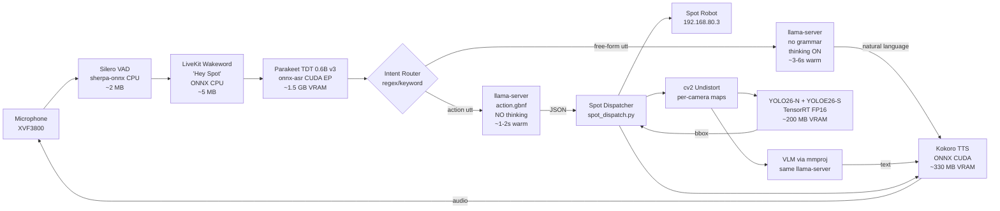
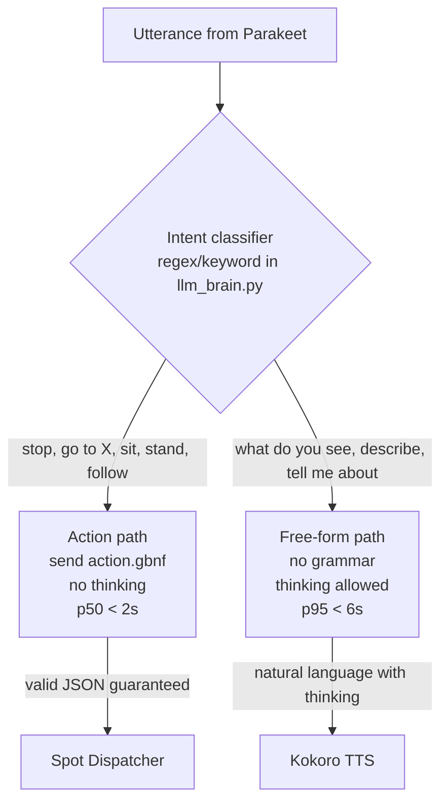
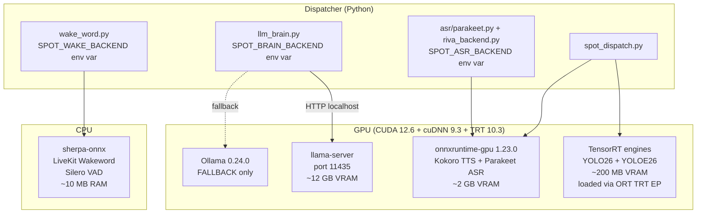
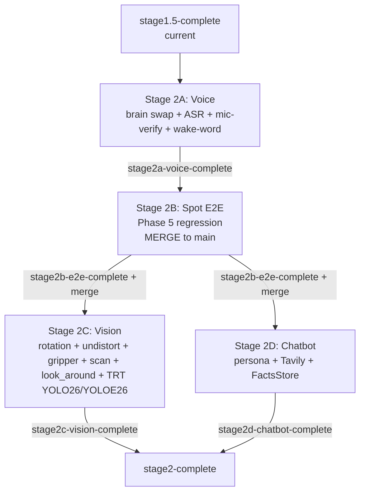

# Stage 2 Architecture Guide

How the Stage 2 voice + perception + chatbot pipeline fits together, why each component was chosen, and how to inspect or roll back each layer.

> **For implementation detail:** see `docs/superpowers/specs/2026-05-15-stage2-design.md` (the design spec) and the Stage 2 sub-plans under `docs/superpowers/plans/`.

## What changes vs Stage 1.5

| Layer | Stage 1.5 (current) | Stage 2 (target) |
|---|---|---|
| Wake word | sherpa-onnx KWS (Gigaspeech-3.3M) | LiveKit Wakeword (Apache 2.0, conv-attention) |
| VAD | webrtcvad (2012-era) | Silero VAD via sherpa-onnx |
| ASR | Riva gRPC bridge (BROKEN — Riva removed in Stage 1) | Parakeet TDT 0.6B v3 via onnx-asr (GPU) |
| Brain runtime | Ollama 0.24.0 | llama.cpp + `llama-server` (HTTP, OpenAI shape) |
| Brain model | gemma4:e4b (unchanged) | gemma4:e4b GGUF Q4_K_M + mmproj + E2B drafter |
| JSON enforcement | Ollama `format:json` (broken on gemma4, bug #15260) | GBNF grammar at llama.cpp sampler level |
| Thinking mode | Forced ON (Ollama bug workaround) | Adaptive per-call (action = off, free-form = on) |
| Vision models | YOLOv8 + YOLO-Worldv2-s | YOLO26-N + YOLOE26-S, TensorRT FP16 engines |
| Fisheye handling | Rotation only (sideways → upright) | Rotation + cv2 undistortion (Brown-Conrady / Kannala-Brandt) |
| Chatbot | Knowledge packs only (Stage B) | + Persona + Tavily web_search + FactsStore SQLite |

The voice loop is currently broken because `server.py` imports `riva.client` and Stage 1 removed Riva. Stage 2A.0-2A.4 unblocks it.

---

## High-level data flow (Stage 2 target)



**Single llama-server process** holds gemma4 + mmproj + E2B drafter (~12 GB VRAM, long-lived daemon on port 11435). Action and free-form paths are the same model — they differ only in what request body the dispatcher sends.

---

## Why these choices

### Brain runtime: llama.cpp instead of Ollama

Ollama 0.24.0 has a bug cluster (#15260, #15416, #15502, #15539, #15595, #15288) where `think:false` + `format:json` silently drops the JSON constraint on gemma4. The documented workaround = keep thinking ON, which costs ~5 s median latency. vLLM has the same bug class (#39130) — switching to vLLM does not fix it.

llama.cpp's GBNF grammar enforces JSON at the sampler level, completely bypassing the thinking-mode path. The bug never triggers because we're not asking the runtime to gate on thinking tokens.

**Why HTTP server, not Python bindings:** `llama-cpp-python` re-introduces a numpy dependency that would break the load-bearing `numpy==1.26.4` pin (which onnxruntime-gpu, kokoro-onnx, and opencv-python all depend on). The HTTP `llama-server` is pure C++ with zero Python deps → zero ABI risk to the pinned stack.

### Adaptive thinking (per-call grammar selection)

gemma4 is a thinking model. Thinking improves quality on free-form tasks (descriptions, knowledge queries) but adds 3-4 s latency that's intolerable for snappy action dispatch ("stop", "go to the kitchen"). The Stage 2 approach: pick grammar per request based on intent.



`action.gbnf` enumerates valid action names (`"stand" | "sit" | "go_to" | ...`) so the model cannot emit nonsense like `action: "quack"`. The grammar starts with `{` so no `<think>` prefix is allowed — the model jumps straight to JSON emission.

Free-form path sends no grammar at all. Model produces free text, optionally with a `<think>...</think>` reasoning prefix (which the dispatcher strips before sending to TTS).

### ASR: Parakeet over Whisper / Riva / others

Parakeet TDT 0.6B v3 was trained on 36 k hours of non-speech audio with empty-string targets — hardened against the "thank you for watching" hallucination class that plagues Whisper-family models on motor noise. On Jetson AGX Orin: ~10 × faster than Whisper Large V3 Turbo per NVIDIA benchmarks. License is permissive (NVIDIA Open Model License), ships via `onnx-asr` so it slots into the existing onnxruntime-gpu stack with zero new ABI surface.

Canary-Qwen-2.5B has higher accuracy but is 4 × bigger — wrong tradeoff for tour-guide latency.

### Wake word: LiveKit over openWakeWord

LiveKit Wakeword's conv-attention head is structurally better suited to noisy-environment false-positive suppression than openWakeWord's vanilla DNN. Same ONNX format, same Piper-synthetic training pipeline, same ~5 MB model size, drop-in compatible loaders. Apache 2.0.

Vendor claims (60 × lower AUT, 100 × fewer FPs) are not independently reproduced. Real-world expectation: 2-3 × improvement, which is still meaningful in a Baker-Berry tour-group setting.

### Vision: YOLO26 + YOLOE26 with TensorRT engines

YOLO26 (released 2026-01-14) is NMS-free, DFL-removed, with MuSGD optimizer + ProgLoss + STAL. Ultralytics' published AGX Orin 64 GB benchmark: YOLO26n TRT FP16 = **2.62 ms/frame (≈ 382 FPS)** — 10 Hz follow loop met 20 × over.

YOLOE26-S (paper Feb 2026) is the open-vocabulary variant. +11.4 LVIS AP over YOLO-World-S. Prompt-free mode with built-in 4585-class RAM++ vocab — no manual class-list maintenance.

**Why TensorRT engines, not ONNX:** Ultralytics benchmark shows TRT FP16 = 2.62 ms vs ONNX = 9.87 ms for YOLO26n on AGX Orin. 3.8 × speedup. No new runtime install — onnxruntime-gpu 1.23.0 already exposes `TensorrtExecutionProvider`, and ultralytics' `model.export(format='engine', half=True)` produces a `.engine` file that loads back through the same `YOLO()` API.

### Fisheye undistortion: cv2 + cached intrinsics

Boston Dynamics' `ImageSource` proto carries three distortion models (`pinhole`, `pinhole_brown_conrady`, `kannala_brandt`). The SDK ships the parameters but NOT the undistortion code — wire cv2 yourself.

The existing `src/voice_control/perception/camera_intrinsics.py` (160 LOC, already shipped) caches per-robot intrinsics. Stage 2C.0.5 adds a `_undistort_for_source` helper that precomputes `cv2.initUndistortRectifyMap` per camera at startup, then applies `cv2.remap` per frame (~3-5 ms CPU on Orin).

Pipeline order: `capture → rotate (Stage 0) → undistort (Stage 0.5) → output Frame` → downstream YOLO/VLM consume rectified pinhole-equivalent frames. Removes the "no fisheye-trained YOLO checkpoint exists" concern.

---

## Runtime stack (multi-runtime, sane)



**3 runtimes on one Jetson is fine.** Verified during research: CUDA contexts ≈ 150 MB each (cheap), unified memory budget on AGX Orin 64 GB is generous, no driver locking on Tegra iGPU. `OLLAMA_KEEP_ALIVE=-1` (already set in Stage 1.5) prevents Ollama unload thrash if it stays as a hot fallback.

TRT engines load through ORT's `TensorrtExecutionProvider` — same CUDA context as ORT's `CUDAExecutionProvider`. Not really a "4th runtime" surface; shares ORT's stack.

---

## Sub-plan map



2A → 2B sequential (2B is the merge moment). After merge, 2C and 2D run in parallel because they touch different files (`visual_nav.py` + perception vs `chatbot/` + `facts_store.py`).

---

## Rollback architecture (env-var-driven)

| Layer | Env var | Default (Stage 2) | Rollback |
|---|---|---|---|
| Brain runtime | `SPOT_BRAIN_BACKEND` | `llamacpp` | `ollama` (Stage 1.5 default) |
| Brain model | `DEFAULT_MODEL` + `VLM_MODEL` in `llm_brain.py` | `gemma4:e4b` | `qwen2.5:7b` + `qwen2.5vl:7b` (Stage 1 rollback, on disk until 2A.3 passes) |
| ASR backend | `SPOT_ASR_BACKEND` | `parakeet` | `riva` (code path stays until 2A.4 deletes it; Riva server itself gone) |
| Wake word | `SPOT_WAKE_BACKEND` | `livekit` | `sherpa_onnx` |
| Vision model load | file extension | `.engine` (TRT) | `.pt` (PyTorch, same files on disk) |

All flip-and-restart, no code edits required. The `qwen2.5*` rollback also requires the 2-line `llm_brain.py` edit (model name strings).

Code rollback layers (deeper):
- Git tag `stage1.5-complete` = pre-Stage-2 stable point
- Git tag `stage2a-voice-complete` = after 2A passes
- Git tag `stage2b-e2e-complete` = post-merge to `main` (on `main`, not the feature branch)
- Stage 1.5 `docs/project/stage1-rollback.md` still covers eMMC + SSD + Ollama binary + Riva re-acquisition + VS Code restoration. Stage 2 adds `docs/project/stage2-rollback.md` (written incrementally per sub-plan).

---

## How to inspect / debug each layer

### Brain (llama-server)

```bash
# Health check
curl http://localhost:11435/health

# Prometheus metrics (token/s, request count, error count)
curl http://localhost:11435/v1/metrics

# Manual JSON test (action grammar)
curl http://localhost:11435/v1/chat/completions \
  -H 'Content-Type: application/json' \
  -d @action-test-payload.json

# Logs (systemd user unit)
journalctl --user -u llama-server -f --output=json

# Tail the [Brain-timing] markers in the dispatcher
journalctl -t voice_control -f | grep Brain-timing
```

### ASR (Parakeet)

```bash
# Smoke transcribe a test WAV
python -c "
from src.voice_control.asr.parakeet import ParakeetBackend
b = ParakeetBackend()
with open('tests/audio/walk_forward_1m.wav', 'rb') as f:
    print(b.transcribe(f.read()))
"
```

### Wake word (LiveKit vs sherpa-onnx)

```bash
SPOT_WAKE_BACKEND=livekit  python scripts/wake_word_loop.py --duration 30
SPOT_WAKE_BACKEND=sherpa_onnx python scripts/wake_word_loop.py --duration 30
# Compare false-positive count over the same 30s noisy clip
```

### Vision (TRT engine vs .pt)

```bash
# Verify engine loads + GPU utilization spikes (NOT 0%)
tegrastats --interval 1000 &
python -c "
from ultralytics import YOLO
m = YOLO('/mnt/ssd/cfm_mppi_caches/yolo_engines/yolo26n.engine')
import time
for _ in range(20):
    t0=time.time(); m.predict('tests/images/spot_view.jpg', verbose=False); print((time.time()-t0)*1000, 'ms')
"
# GR3D_FREQ in tegrastats output should be > 0
```

### Fisheye undistortion

```bash
# Spot check: capture from one fisheye, save raw + rotated + undistorted side-by-side
python scripts/debug_undistort.py --source frontleft_fisheye_image --out /tmp/debug.png
```

---

## Performance expectations (warm)

| Component | Stage 1.5 (current) | Stage 2 (target) |
|---|---|---|
| Wake word detect | sherpa-onnx ~50 ms (CPU) | LiveKit ~30 ms (CPU) |
| VAD frame decision | webrtcvad ~1 ms | Silero ~0.5 ms |
| Parakeet 5 s utterance ASR | (broken — Riva removed) | ~500-800 ms (CUDA EP) |
| Brain action JSON dispatch | gemma4 in Ollama, thinking forced ON, ~5 s | gemma4 in llama.cpp + action.gbnf, no thinking, ~1-2 s |
| Brain free-form description | (same as above) | gemma4 in llama.cpp, thinking ON, ~3-6 s |
| TTS Kokoro 10-word phrase | ~400 ms | unchanged |
| YOLO person detect per frame | YOLOv8n CPU ~330 ms | YOLO26-N TRT FP16 ~3 ms |
| 5-camera open-vocab scan | YOLO-Worldv2-s serial ~5 s | YOLOE26-S batched ~400-600 ms |
| Fisheye undistort per frame | n/a (no undistort) | ~3-5 ms CPU |

Total voice-loop wall time, action path: **~3-4 s** (wake + VAD + ASR + brain JSON + TTS confirmation), vs Stage 1.5's broken-or-7s+ baseline.

---

## Things deliberately NOT in Stage 2

| Item | Reason | Where it goes |
|---|---|---|
| AprilTag follow-mode | YOLO26-N on undistorted fisheye is the primary follow path. AprilTag is exploratory backup. | Stage 3 spike if 2B follow regression fails |
| Two-brain split (fast text + heavy VLM) | Single-brain llama.cpp + adaptive thinking is the cheaper first try | Stage 3 if latency telemetry shows single-brain falls short |
| qwen3-vl:8b-instruct swap | User opted to keep gemma4 primary; qwen3-vl would fix bug #15260 the alternative way | Stage 3 alternative if llama.cpp + GBNF underdelivers |
| vLLM / TRT-LLM brain runtime | vLLM has same JSON bug class; TRT-LLM Jetson has no confirmed gemma4 support | Revisit when either ships a fix |
| Door opening | On ice per `MEMORY.md`; needs Spot testing | Separate plan |
| Stair-aware follow | Spot ascends forward, descends backwards — special handling | Future plan after follow ships |
| Fisheye YOLO fine-tune (FishEye8K) | Undistort handles it for now | Only if undistort + AprilTag both fail |
| Parakeet realtime EOU 120M | Future "interruptible mode" voice agent | Out of Stage 2 — basic loop first |
| onnxruntime-gpu upgrade past 1.23.0 | No newer wheel exists for jp6/cu126/cp310; cascade-breaks ABI pins | Revisit when Jetson AI Lab publishes 1.25/1.26 |

---

## References

- Design spec: `docs/superpowers/specs/2026-05-15-stage2-design.md`
- Stage 1 + 1.5 rollback runbook: `docs/project/stage1-rollback.md`
- Voice pipeline state machine: `docs/architecture/voice-pipeline.md`
- System overview: `docs/architecture/overview.md`
- Stage 1 instrumentation: commit `fce3e62` (`[Brain-timing]` logs)
- Pin guardian: `.claude/agents/pin-guardian.md`
- Safety reviewer: `.claude/agents/safety-reviewer.md`
