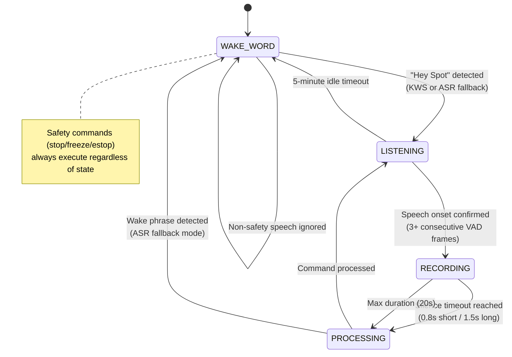

# Voice Pipeline Deep Dive

The voice pipeline in `src/voice_control/client_mic.py` handles the full path
from raw microphone audio to executed robot commands. This document covers the
state machine, audio processing, and timing characteristics.

## State Machine



**State descriptions:**

- **WAKE_WORD** -- Waiting for "Hey Spot". The wake word detector
  (`sherpa-onnx KeywordSpotter`) processes every audio frame. Safety commands
  still execute via VAD + ASR. All other speech is discarded.
- **LISTENING** -- Wake word heard, waiting for speech. VAD monitors energy
  levels. Transitions back to WAKE_WORD after 5 minutes of idle.
- **RECORDING** -- Speech detected. Audio frames accumulate in a buffer.
  Silence timeout triggers processing. Two timeouts: short (0.8s) for brief
  commands, long (1.5s) for chained commands (crossover at 2s of speech).

## Audio Flow

```
sounddevice callback (stereo -> mono PCM16)
        |
        v
    audio_queue (thread-safe)
        |
        v
    Main loop: extract 30ms frames
        |
        +---> Wake word detector (every frame in WAKE_WORD state)
        |
        +---> Compute frame RMS energy
        |
        +---> Energy gate (frame_rms > threshold?)
        |         |
        |         +---> No: update adaptive noise floor (EMA)
        |         +---> Yes: WebRTC VAD check
        |                    |
        |                    +---> Speech onset debounce (3 consecutive frames)
        |                    +---> Accumulate to speech_buffer
        |                    +---> Pre-roll buffer (5 frames before onset)
        |
        +---> Silence timeout check
                  |
                  v
              process_utterance()
```

**Key details:**

- The `sounddevice` callback runs in a separate OS thread. It selects
  channel 0 (beamformed left) from the XVF3800 stereo mic and pushes
  30ms frames into a `queue.Queue`.
- The mic is muted during TTS playback (`_mic_muted` flag) to prevent
  the robot from hearing its own voice.
- After processing, stale audio is drained but the last ~1 second is
  kept so new speech arriving during processing is not lost.

## Processing Flow: `process_utterance()`

`process_utterance()` is the core function called after silence timeout.
It takes the accumulated speech buffer and produces robot actions.

### Step 1: Safety Fast-Path (regex, <5ms)

```python
SAFETY_PATTERNS = [
    (r"\b(?:stop|halt)\b",                     "stop"),
    (r"\bfreeze\b",                            "freeze"),
    (r"\b(?:emergency\s+stop|e[\s-]?stop)\b",  "estop"),
]
```

Safety commands are checked via simple regex immediately after ASR returns.
If matched, the command is dispatched to Spot instantly -- no LLM involved.
Safety commands execute in all states, even WAKE_WORD.

### Step 2: Wake Phrase Strip

When using the dedicated wake word detector, the ASR transcript may still
contain the wake phrase ("Hey Spot stand up"). The wake phrase is stripped
before passing to the LLM:

```
"Hey Spot stand up" -> "stand up"
```

This allows users to say "Hey Spot" and their command in one breath.

### Step 3: LLM Brain (structured JSON)

The transcript plus current robot state (battery, position, saved locations)
is sent to Ollama. The LLM returns structured JSON:

```json
{
  "actions": [
    {"action": "walk", "params": {"direction": "forward", "distance": 2}},
    {"action": "sit", "params": {}}
  ],
  "response": "Walking forward 2 meters and then sitting down!"
}
```

The response is spoken via TTS before actions execute.

### Step 4: VLM for Describe Action

When the LLM returns a `describe` action:

1. Capture a JPEG frame from the specified camera (default: front).
2. If a specific query was given (e.g., "do you see a chair?"), run YOLO
   detection first to provide a hint to the VLM.
3. Send the image + first-person prompt to the VLM (`qwen2.5vl:7b`).
4. Speak the VLM response via TTS.

The VLM prompt enforces first-person perspective: "You are looking around"
rather than "This image shows". The VLM is warmed up on-demand (not at
startup) because it shares VRAM with the text LLM.

### Step 5: Command Chaining

Multiple actions are executed sequentially with synchronization waits:

| Command Type | Wait Strategy |
|---|---|
| `go_to`, `tour`, `patrol`, `come_back`, `go_to_object`, `follow_me` | `_wait_for_nav_complete()` -- polls `is_navigating()` |
| `walk`, `strafe`, `turn` | Fixed 3.0s delay |
| `sit`, `stand`, `selfright`, `body_height` | Fixed 4.0s delay |

If any action in the chain fails, the chain stops immediately.

## Key Configuration Parameters

| Parameter | Value | Purpose |
|---|---|---|
| `SAMPLE_RATE` | 16000 Hz | Standard for speech recognition |
| `FRAME_MS` | 30 ms | Audio frame size (480 samples) |
| `VAD_LEVEL` | 1 | WebRTC VAD aggressiveness (0-3); 1 catches softer speech |
| `SILENCE_TIMEOUT_SHORT` | 0.8 s | Silence timeout for utterances < 2s |
| `SILENCE_TIMEOUT_LONG` | 1.5 s | Silence timeout for utterances > 2s (chains) |
| `SILENCE_CROSSOVER` | 2.0 s | Speech duration to switch from short to long timeout |
| `SPEECH_ONSET_FRAMES` | 3 | Consecutive VAD+energy frames to confirm speech (~90ms) |
| `NAV_ONSET_FRAMES` | 5 | Higher onset threshold during navigation (~150ms) |
| `PREROLL_FRAMES` | 5 | Frames kept before onset (~150ms) to capture word beginnings |
| `MAX_UTTERANCE_SECONDS` | 20 s | Force-process after this duration |
| `NOISE_CALIBRATION_SECONDS` | 2 s | Ambient noise measurement at startup |
| `ENERGY_THRESHOLD_MULTIPLIER` | 2.0x | Speech must be this much louder than noise floor |
| `NOISE_EMA_ALPHA` | 0.03 | Exponential moving average for adaptive noise floor |
| `NOISE_FLOOR_MIN` | 0.001 | Minimum noise floor (prevents threshold dropping to zero) |
| `NOISE_FLOOR_MAX` | 0.05 | Maximum noise floor (prevents threshold going too high) |
| `NAV_ENERGY_MULT` | 5.0x | Extra energy multiplier during GraphNav navigation |
| `LISTENING_TIMEOUT` | 300 s | Return to WAKE_WORD after 5 minutes of idle |
| `MIN_SPEECH_DURATION` | 0.3 s | Reject utterances shorter than this (noise bursts) |

## Typical Latencies

| Stage | Latency | Notes |
|---|---|---|
| Wake word detection | ~0 ms | Runs inline on every 30ms frame |
| VAD + onset confirmation | ~90 ms | 3 frames at 30ms each |
| ASR (server.py backend) | 0.5 - 2.0 s | Depends on utterance length |
| LLM (qwen2.5:7b warm) | 0.2 - 1.0 s | Prompt cached after warm-up |
| LLM (cold start) | 10 - 17 s | Model loading into VRAM |
| VLM (qwen2.5vl:7b warm) | 2 - 6 s | Image + text inference |
| VLM (cold start) | ~17 s | Model loading into VRAM |
| TTS (Kokoro) | 0.1 - 0.5 s | Generation + playback starts immediately |
| Safety command (stop/estop) | < 5 ms | Regex match, no LLM |
| **Typical end-to-end** | **1.5 - 4.0 s** | Wake word to action execution (warm) |
